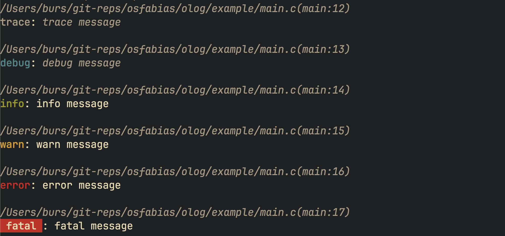

# olog.c
Simple cross-platform logging library for C99.



#### Example
```c
#include "olog.h"

int main(void)
{
  olog_config config = {
    .file_path = "logs.txt",
    .level = OLOG_LEVEL_TRACE,
  };

  olog_init(config);
  olog_info("hello, world!");
  olog_deinit();

  return 0;
}
```

#### How to use with CMake
```cmake
add_subdirectory(olog)
...
target_link_libraries(<target_name> <mode> olog)
```

#### How to build
```sh
cmake -B build .
cmake --build build
```

